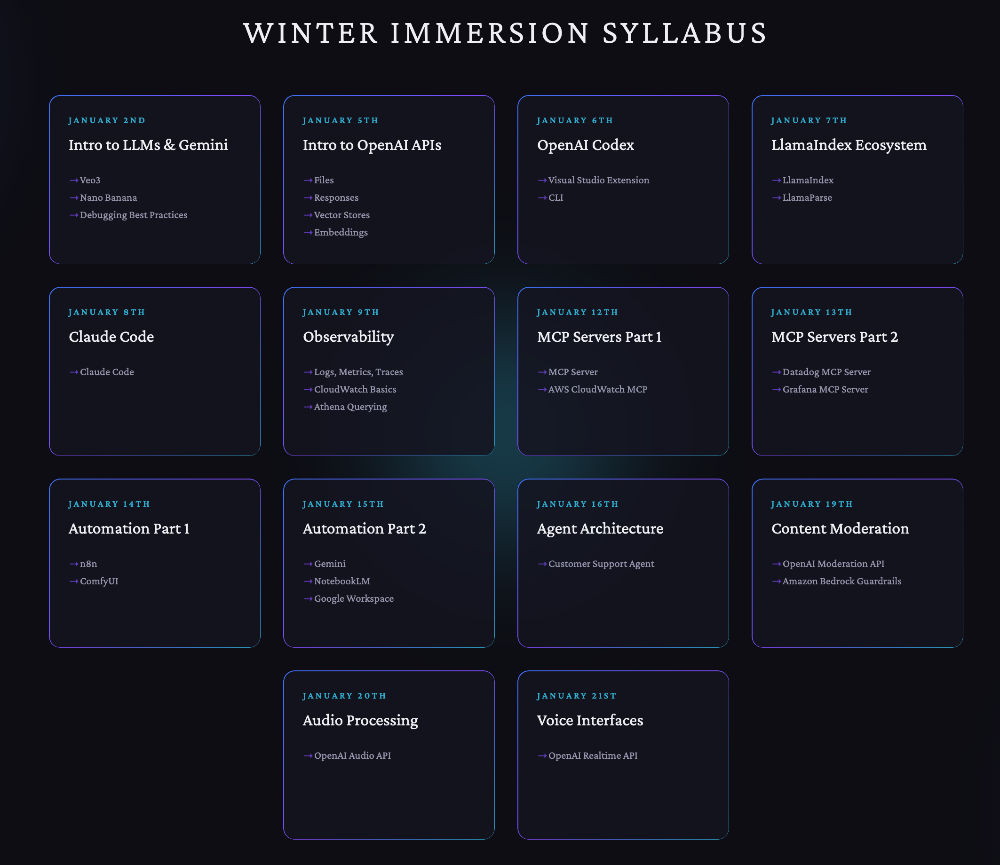

Slides for each day will be uploaded to the `slides` folder at the root level of this repo

Both in in-class labs and homework for each day will be uploaded to the `assignments` folder at the root level of this repo

## To run locally
1. `npm install`
2. `npm run dev`
3. Click on a lesson to view the code sample we will be working with for the day

## Course Syllabus

### January 2nd
* Gemini APIs for AI Ad Creation
    * Veo3
    * Nano Banana 
* Debugging Best Practices

### January 5th 
* OpenAI APIs
  * Files
  * Responses
  * Vector Stores
  * Embeddings

### January 6th
  * OpenAI Codex
    * Visual Studio extension
    * CLI

### January 7th
* LlamaIndex
* LlamaParse

### January 8th
* Claude Code

### January 9th
* Observability Foundations
  * Observability concepts
  * Logs, metrics, traces
  * CloudWatch basics
  * Athena querying
 
### January 12th
* MCP Server
* AWS Cloudwatch MCP Server

### January 13th
* Datadog MCP Server
* Grafana MCP Server

### January 14th

* n8n 
* comfyUI

### January 15th

* Gemini + NotebookLM + Google Workspace

### January 16th

* Customer Support Agent Architecture

### January 19th

* OpenAI Moderation API

### January 20th

* OpenAI Audio API

### January 21st

* OpenAI Realtime API (Voice)

