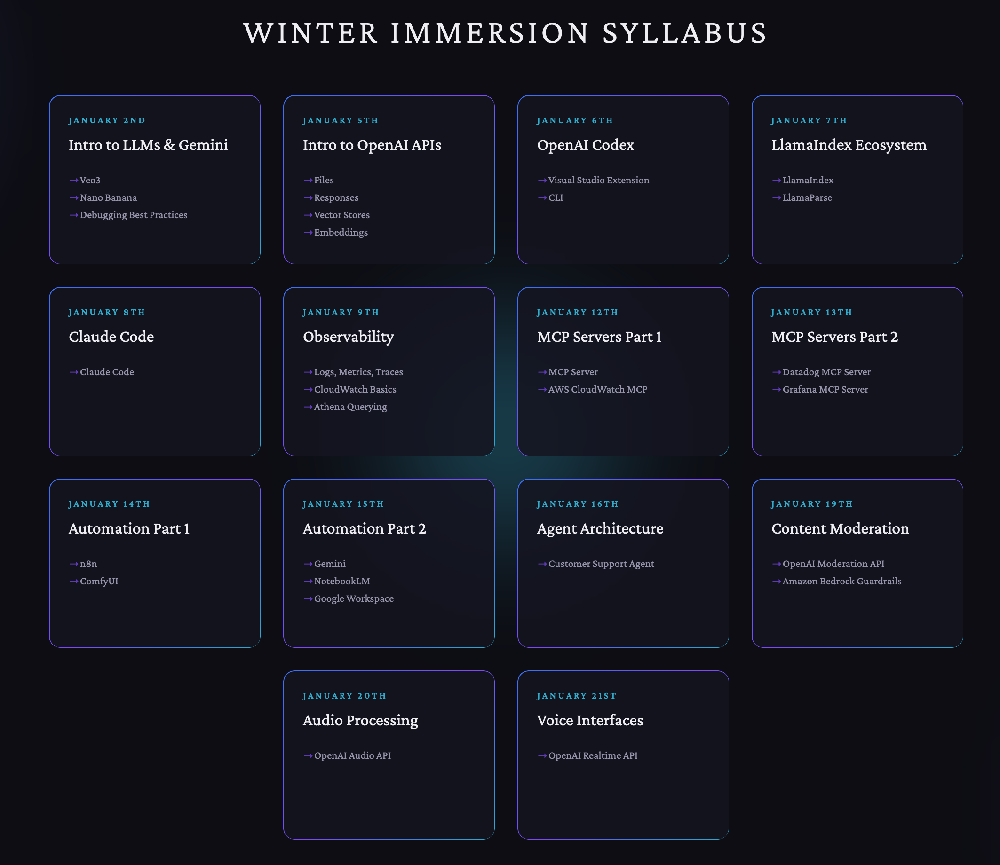

Slides for each day will be uploaded to the `slides` folder at the root level of this repo

Both in in-class labs and homework for each day will be uploaded to the `assignments` folder at the root level of this repo

Lecture recordings for each day can be accessed by clicking the 📺 emoji next to each date

## To run locally
1. `npm install`
2. `npm run dev`
3. Click on a lesson to view the code sample we will be working with for the day

## Course Syllabus

🚨 **If you are not comfortable entering in credit card information into the official LLM platform then try to below alternatives that offer free credits without entering card details first:**  🚨

* https://openrouter.ai/
* https://groq.com/pricing -> https://console.groq.com/settings/billing/plans -> https://console.groq.com/playground
* https://ai.google.dev/gemini-api/docs/pricing -> https://aistudio.google.com/

Video recording of me explaining this problem & solution: [📺](https://youtu.be/xT0XqRc31w8)

### January 2nd

* Gemini for AI Ad Creation
    * Veo3 via https://kie.ai/
    * Nano Banana via https://gemini.google.com/app
* Debugging Best Practices
* Objectives:
  * Explain what the Gemini API is and what problems it solves
  * Identify real-world use cases for AI-generated advertising
  * Explain what Veo3 is and how text-to-video models work at a high level
  * Explain what debugging is in modern software systems
  * Describe the difference between day-to-day debugging and on-call debugging
* Lecture outlines: [Gemini API](curriculum/01-02-gemini-api-ai-ad-creation/lecture-outline.md) | [Veo3](curriculum/01-02-veo3/lecture-outline.md) | [Nano Banana](curriculum/01-02-nano-banana/lecture-outline.md) | [Debugging](curriculum/01-02-debugging-best-practices/lecture-outline.md)
* Lecture recording: [📺](https://youtu.be/QcBWaeDZIm8)
* Why engineering jobs other swe are important to consider [📺](https://youtube.com/shorts/9YmDu8rrUNw)

### January 5th 

* OpenAI Moderation API: https://platform.openai.com/docs/guides/moderation
* Objectives:
  * learn how to make AI influencers
  * Explain why safety and guardrails are required in AI systems
  * Describe how the OpenAI Moderation API works
  * Explain the purpose of Amazon Bedrock Guardrails: https://aws.amazon.com/bedrock/guardrails/
  * AI influencer example: https://github.com/MidnightCoder06/malik-stone-ai
  * Identify risks associated with unguarded AI deployments
* Lecture outline: [Moderation & Guardrails](curriculum/01-19-moderation-guardrails/lecture-outline.md)
* Lecture recording: [📺](https://www.youtube.com/@jeanleconteii)

* Observability Foundations
  * Observability concepts
  * Logs, metrics, traces
  * CloudWatch basics: https://aws.amazon.com/cloudwatch/
  * Athena querying: https://aws.amazon.com/athena/
  * What is Redshift: https://aws.amazon.com/pm/redshift/
* Objectives:
  * Explain what observability is and why it matters in modern systems
  * Distinguish between logs, metrics, and traces
  * Explain how observability differs from basic monitoring
  * Identify where observability fits in AI and distributed systems
* Lecture outline: [Observability Foundations](curriculum/01-09-observability-foundations/lecture-outline.md)
* Lecture recording: [📺](https://youtu.be/039WlEdsDWU)

### January 6th

* LlamaIndex: https://www.llamaindex.ai/
* LlamaParse: https://www.llamaindex.ai/llamaparse
* LlamaCloud: https://www.llamaindex.ai/llamacloud
* Objectives:
  * Explain what LlamaIndex is and why it exists
  * Describe how LlamaIndex differs from raw embedding pipelines
  * Explain the role of LlamaParse in document ingestion
  * Identify when LlamaIndex is the right abstraction for AI systems
* Lecture outline: [LlamaIndex & LlamaParse](curriculum/01-07-llamaindex-llamaparse/lecture-outline.md)
* Lecture recording: [📺](https://youtu.be/kI8-mgjci-8)

* OpenAI APIs
  * Files: https://platform.openai.com/docs/api-reference/files
  * Responses: https://platform.openai.com/docs/api-reference/responses
  * Vector Stores: https://platform.openai.com/docs/api-reference/vector-stores
  * Embeddings: https://platform.openai.com/docs/api-reference/embeddings
* Sample project that uses them: https://github.com/MidnightCoder06/housing-justice-builder
* Objectives:
  * Explain what embeddings are and why they matter
  * Describe the purpose of files and vector stores in AI systems
  * Explain how embeddings enable semantic search and retrieval
  * Identify real-world use cases for vector-based systems
* Lecture outline: [OpenAI APIs](curriculum/01-05-openai-apis-files-vector-stores-embeddings/lecture-outline.md)
* Lecture recording 1: [📺](https://youtu.be/3rZIk4ICJp0)
* Lecture recording 2: [📺](https://youtu.be/OvstUQKNkqM)

* OpenAI Audio API: https://platform.openai.com/docs/api-reference/audio
* Objectives:
  * Explain what the OpenAI Audio API is
  * Describe the difference between text-to-speech and speech-to-text
  * Identify use cases for audio interfaces in AI systems
  * Explain tradeoffs between audio, text, and multimodal interfaces
* Lecture outline: [OpenAI Audio API](curriculum/01-20-openai-audio-api/lecture-outline.md)
* Lecture recording: [📺](https://youtu.be/RUHP7YdJwPs)

* OpenAI Realtime API (Voice): https://platform.openai.com/docs/guides/realtime
* Objectives:
  * Explain what the OpenAI Realtime API is
  * Describe how realtime voice interactions differ from batch audio processing
  * Identify use cases that require low-latency voice AI
  * Explain architectural considerations for realtime systems
* Lecture outline: [OpenAI Realtime API](curriculum/01-21-openai-realtime-api-voice/lecture-outline.md)
* Lecture recording: [📺](https://youtu.be/RUHP7YdJwPs)

### January 7th

* Video overview of new [syllabus](https://youtu.be/GKL4id7X0Go)

* Lecture: OpenAI Codex
  * Visual Studio extension
  * CLI
* Objectives:
  * Explain what OpenAI Codex is and how it differs from general LLM usage
  * Describe how Codex assists developers in real workflows
  * Identify appropriate use cases for Codex in CLI and IDE environments
  * Explain the risks of over-reliance on AI coding tools
* Lecture outline: [OpenAI Codex](curriculum/01-06-openai-completions/lecture-outline.md)
* Lecture recording - Intro to Codex: [📺](https://youtu.be/ev3lzf-ztxI)
* Setup Instructions: [📺](https://youtu.be/DzEIDdd1SVQ)

* In class OpenAI Audio API & Realtime API Exercise

* In class Debugging Exercise
  Fix the following
  * Should be able to type in the form
  * Text should not be cut off
  * The form should be centered in the screen 
  * Should be responsive on both mobile and web
  * The profile should appear
  * The submit button being clicked shouldn't crash the page

* [Manus Acquisition By Meta Recap](https://youtube.com/shorts/UsjxhnGdmFQ?si=pJrLjhNyOL6Bv9OK)

* [Which model to use for what Recap](https://youtube.com/shorts/SUTDqFiLdPc?si=aP6orjDkTlHkGgVz)

### January 8th

* n8n 
* comfyUI
* Objectives:
  * Explain what workflow automation is and why it matters
  * Describe how n8n enables event-driven automation
  * Explain what ComfyUI is and how it fits into AI pipelines
  * Identify use cases where automation compounds value

* MCP Server
* Setting up Cloudwatch
* AWS Cloudwatch MCP Server
* Objectives:
  * Explain what the Model Context Protocol (MCP) is
  * Describe how MCP servers extend AI systems with operational context
  * Explain how observability data can be accessed through MCP
  * Identify use cases for MCP in AI-driven operations

### January 9th

Intro to AI Support Agent Project

* Design Doc: https://docs.google.com/document/d/1g-pbTmyfLU086hOvp7pR1ZMyNOEzm-tLyXif_Wo1Q8M/edit?usp=sharing
* Lecture recording: [📺](https://youtu.be/utZKjL9iDog)

### January 12th

* Claude Code
* Objectives:
  * Explain what Claude Code is and how it differs from general LLM usage
  * Describe how Claude Code assists developers in real workflows
  * Identify appropriate use cases for Claude Code in CLI and IDE environments
  * Explain the risks of over-reliance on AI coding tools
* Why use Claude Code: [📺](https://youtube.com/shorts/Y1uGvd607Fk?si=YngvUQNFG1nTBTf6)
* Setting up Claude Code: [📺](https://youtu.be/5P6v4hUJAis)

### January 13th

* Read: [📜](https://docs.google.com/document/d/1ivdy8bHlkF322GEfe4-C3dEcKyXrHfYcEN9OKrCHFQk/edit?usp=sharing)

### January 14th

* Setting up Athena 
* Setting up Cloudwatch
* Setting up Redshift

### January 15th

* Lecture recording -> MCP Servers: [📺](https://youtu.be/nflqgZU5aJY)
* Read: [📜](https://docs.google.com/document/d/1JMMyEcjX6sRuOLTdJk8sE4Qd1EEqwVaacQloH_URveo/edit?usp=sharing)
* Assignment: [📜](https://docs.google.com/document/d/1fOu2ll-hL8pMWaWm0c0-DQO9nisO0S-5crGdwdZjkKc/edit?usp=sharing)

### January 16th
* Claude Code Skills & Subagents

### January 20th
* LlamaIndex & LlamaParse Pt. 2
* Incorporate that into your file upload / vector store project
* Set up legal agent project
* n8n & comfyUI Pt. 2 <> Learn how to automate strings of api cals
* Use Manus to set up consulting agent project

### January 21st
* Using Ollama to customize an open source model (llamaa) and use it locally
* Using Bedrock to set up popular LLMS and implementing AWS guardrails
* n8n Sales Agent